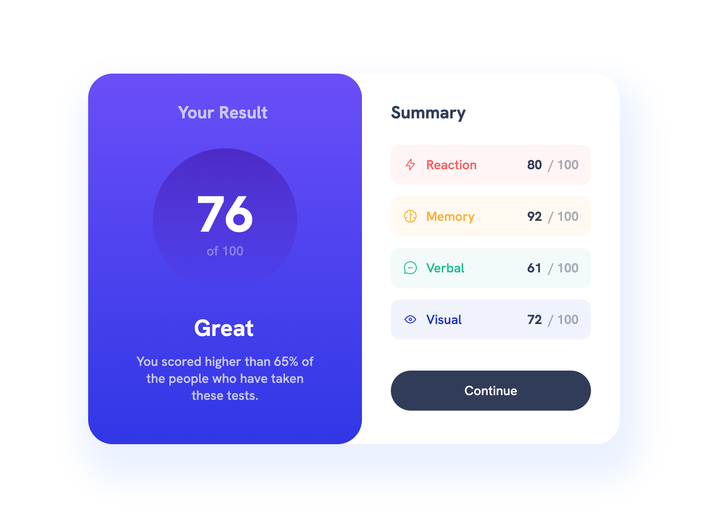

# Frontend Mentor - Results summary component solution

This is a solution to the [Results summary component challenge on Frontend Mentor](https://www.frontendmentor.io/challenges/results-summary-component-CE_K6s0maV). Frontend Mentor challenges help you improve your coding skills by building realistic projects. 

## Table of contents

- [Overview](#overview)
  - [The challenge](#the-challenge)
  - [Screenshot](#screenshot)
  - [Links](#links)
  - [Built with](#built-with)
- [Author](#author)

## Overview

### The challenge

Users should be able to:

- View the optimal layout for the interface depending on their device's screen size
- See hover and focus states for all interactive elements on the page
- See the **cool and soft motion** created with JavaScript and css.

### Screenshot

### Links

- Solution URL: [Frontend Mentor Solution](https://www.frontendmentor.io/solutions/results-summary-component-custom-design-html-css-js-pMDpWCSrbn)
- Live Site URL: [Live Site at Vercel](https://results-summary-component-firoozehimany.vercel.app/)

## My process

### Built with

- Semantic HTML5 markup
- CSS custom properties
- Flexbox
- CSS Motion
- Responsive Design
- Dedicated JavaScript
- fetch API

## Author

- GitHub - [firoozehImany](https://github.com/firoozehImany)
- Frontend Mentor - [firoozehImany](https://www.frontendmentor.io/profile/firoozehImany)
- Twitter - [firoozehImany](https://www.twitter.com/firoozehImany)

